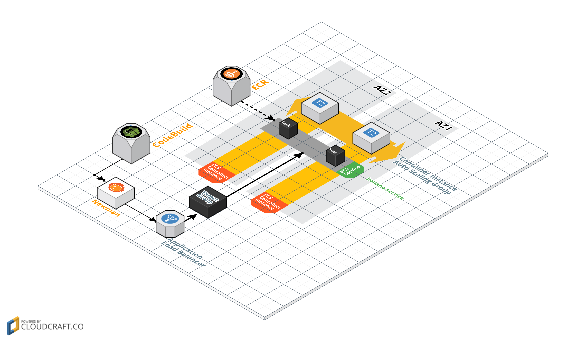

# Overview
This repository contains a lab for the [mu](https://github.com/stelligent/mu) workshop.  The goal of this lab is to add test automation to the lab from the [first lab](https://github.com/stelligent/mu-workshop-lab1).  The repo from the first lab includes an end to end test collection created with [Postman](https://www.getpostman.com/).  Postman is an interactive tool with a GUI, but you can use [Newman](https://github.com/postmanlabs/newman) to run the tests in an automated fashion.




# Continue from lab 1
This lab assumes that you have a pipeline successfully deployed in the first lab.  You can see a completed version of the first lab on the [solution](https://github.com/stelligent/mu-workshop-lab1/tree/solution) branch.

# Configure pipeline
Since **Newman** requires Node.js, use the [Pipelines](https://github.com/stelligent/mu/wiki/Pipelines#configuration) section of the wiki to configure the following for your service pipeline:

* Acceptance image: Update the [image](http://docs.aws.amazon.com/codebuild/latest/userguide/build-env-ref.html#build-env-ref-available) that CodeBuild uses to `aws/codebuild/eb-nodejs-4.4.6-amazonlinux-64:2.1.3`

# Configure CodeBuild for testing
Create a [buildspec-test.yml](http://docs.aws.amazon.com/codebuild/latest/userguide/build-spec-ref.html#build-spec-ref-syntax) to test the service.  The buildspec should have the following configurations:

* Run the command `npm install newman --global` in the **install** phase
* Run the command `newman run -e env.json -r cli src/test/postman/collection.json` in the **build** phase
* Use the path `newman/*` for **files** in the **artifacts** section

#  Pipeline
Now that our service is ready to test, let's update the pipeline for the service:

```
mu pipeline up
```

Finally, push the changes to trigger a pipeline invocation:

```
git add --all
git commit -m "mu testing"
git push
```


# Explore and wait...
While we wait for the pipeline to run, let's explore what mu created:

* **CodePipeline console** - Open the AWS console and navigate to CodePipeline.  Check out the different stages and actions in the pipeline.
    * Which CodeBuild project is creating the `env.json` file tha is used by Newman to determine the hostname of the ELB?
    * How does it generate the `env.json` file?
    * How does CodeBuild know to use the `buildspec-test.yml` file?
    * How did it work in Lab 1, before the file existed?

* **ECS console** - Open the AWS console and navigate to ECS.  Check out the cluster that was created.
    * How many tasks are running for the service?
    * What % of the memory reservation is the service using?  Is that ok?
    * What does the memory and cpu reservation look like for the ECS instances?

* **mu cli** - Monitor the progress of the pipeline with `mu`
    * How can you see the results of the end to end tests from Newman?
